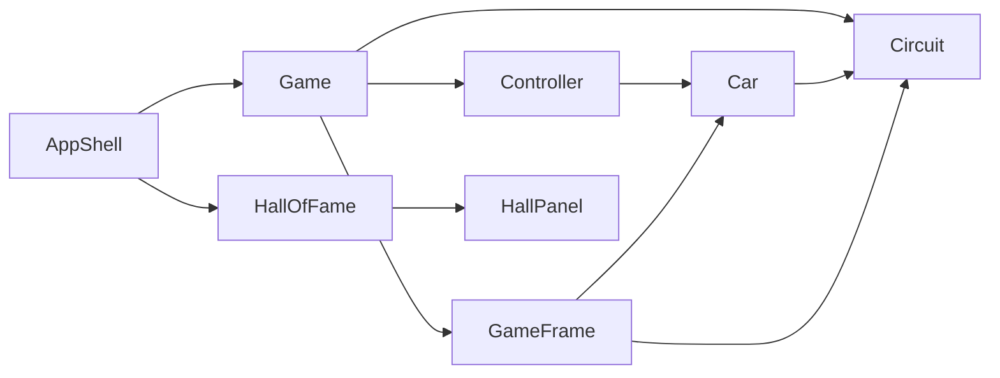

# Super Sprint Supélec


This project was carried out as part of the Supélec engineering curriculum (*Projet Logiciel*, Sequence 6) between November 2014 and February 2015.

The goal was to design and implement a complete desktop application in Java, from requirements analysis through to a playable prototype with documentation.

The chosen theme is a simplified clone of the arcade game [Super Sprint](http://www.giantbomb.com/super-sprint/3030-2776/), a top-down car race on modular tracks, with lap counting, collisions, and a persistent leaderboard.

<video src="https://github.com/alexandrelheinen/super-sprint/releases/download/v2.0/dune-horseshoe-ai-demo.mp4" controls width="720"></video>

[Demo: four AI cars on Dune Horseshoe](https://github.com/alexandrelheinen/super-sprint/releases/download/v2.0/dune-horseshoe-ai-demo.mp4)

## Features

- Top-down arcade racing with nine car liveries and four track layouts
- One- or two-player local multiplayer (remaining slots filled by AI opponents)
- Configurable lap counts with race timer
- Hall of Fame leaderboard stored in the Linux user data directory
- Path-following PD controller for AI drivers, with sparse short-horizon MPCC local avoidance when opponents or walls are nearby (walls are near no-go; car contact is a soft, risk-tolerant preference)

## Requirements

- JDK 17 or newer
- GNU Make
- Python 3 with Pillow (slices `src/sprites/cars.png` at build time)
- A graphical environment to play (X11 on Linux, native display on macOS/Windows)

## Quick start

From the repository root:

```bash
make run
```

This compiles sources into `build/` and launches `controller.Main`.

Other useful commands:

```bash
make compile      # compile only
make smoke-test   # headless startup check (Linux CI)
make demo-race    # all-AI Dune Horseshoe exhibition
make clean        # remove build artifacts
make help         # list targets
```

`make demo-race` requires a track id and car ids (comma-separated is simplest for Make; spaces work if quoted). Optional `LAPS` defaults to 3:

```bash
make demo-race TRACK=3 CARS=0,0,0,0
make demo-race TRACK=3 CARS=identical:0 LAPS=3
make demo-race TRACK=1 CARS="0 1 2 3"
make record-demo TRACK=3 CARS=0,0,0,0
```

Pushing a `v*` tag runs `.github/workflows/release-demos.yml`, which calls `make record-demo` twice under Xvfb and attaches the MP4s to the GitHub Release:

1. **Four fastest cars** (`2,1,7,4`) on Dune Horseshoe, ascending `maxSpeed` grid order.
2. **Four slowest cars** (`5,6,3,0`) on Desert Elbow, same ascending grid order.

See [docs/BUILD.md](docs/BUILD.md) for detailed build instructions and troubleshooting.

## Controls

| Player | Accelerate / brake | Turn |
|--------|-------------------|------|
| 1      | ↑ / ↓ arrow keys  | ← / → arrow keys |
| 2      | W / S             | A / D |

Choose the lap count in Race Setup (default **3**). The first car to finish wins.

## Project layout

```
src/
  controller/   Game loop, input, AI (Main entry point)
  model/        Car physics, track logic, Hall of Fame persistence
  view/         Swing menus and race rendering
  sprites/      Bundled PNG assets (cars + menu cars, tracks, UI)
  third_party/  Vendored Kenney Top-down Tanks Redux zip (build extracts scenery)
  data/         Seed Hall of Fame file copied on first run
docs/           Markdown documentation
build/          Compiled classes and prepared car sprites (generated)
```

On Linux, runtime Hall of Fame data is stored at `$XDG_DATA_HOME/super-sprint-supelec/hall_of_fame.dat` (default: `~/.local/share/super-sprint-supelec/hall_of_fame.dat`), initialized from `src/data/hall_of_fame.dat` when missing.

## Architecture

The codebase follows **Model-View-Controller**:



- **Model** - `Car`, `Circuit`, `HallOfFame`, `Result`, `ResourcePaths`
- **View** - `AppShell` (single window), `GameFrame` (race canvas), screen panels
- **Controller** - `Game`, `Controller`, `HumanController`, `AiController` (PD + sparse Dubins MPCC avoidance), `GameTickTask`

See [docs/REPORT.md](docs/REPORT.md) for the full design document (English translation of the original French project report).

## Documentation

| File | Purpose |
|------|---------|
| [README.md](README.md) | Quick start (this file) |
| [docs/BUILD.md](docs/BUILD.md) | Build and run instructions |
| [docs/CONTRIBUTING.md](docs/CONTRIBUTING.md) | Code standards for contributors |
| [docs/AGENTS.md](docs/AGENTS.md) | Checklist for AI coding assistants |
| [docs/REPORT.md](docs/REPORT.md) | Project report and architecture |

## Continuous integration

GitHub Actions (`.github/workflows/ci.yml`) compiles the project and runs a headless launch smoke test on every push and pull request to `master`.

## License

This project is released under the [MIT License](LICENSE).

Application icon: [Race](https://www.flaticon.com/free-icon/race_4552572) designed by [Magnific](https://www.flaticon.com/authors/magnific) from [Flaticon](https://www.flaticon.com). See [THIRD_PARTY_NOTICES.md](THIRD_PARTY_NOTICES.md).
