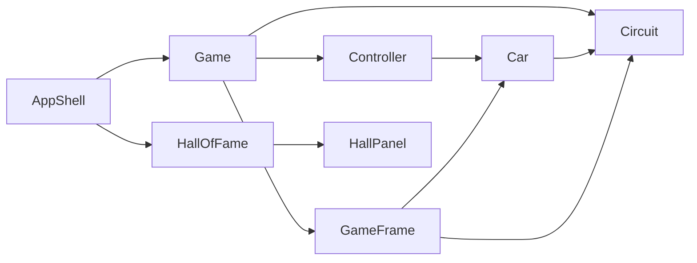

# Super Sprint Supélec


This project was carried out as part of the Supélec engineering curriculum (*Projet Logiciel*, Sequence 6) between November 2014 and February 2015.

The goal was to design and implement a complete desktop application in Java, from requirements analysis through to a playable prototype with documentation.

The chosen theme is a simplified clone of the arcade game [Super Sprint](http://www.giantbomb.com/super-sprint/3030-2776/), a top-down car race on modular tracks, with lap counting, collisions, and a persistent leaderboard.

<video src="https://github.com/alexandrelheinen/super-sprint/releases/download/v2.0/dune-horseshoe-ai-demo.mp4" controls width="720"></video>

[Demo: four AI cars on Dune Horseshoe](https://github.com/alexandrelheinen/super-sprint/releases/download/v2.0/dune-horseshoe-ai-demo.mp4)

## Features

- Top-down arcade racing with nine car liveries and four track layouts
- One- or two-player local multiplayer (remaining slots filled by AI opponents)
- Configurable lap counts with race timer
- Hall of Fame leaderboard in an OS-specific user data directory
- Path-following PD controller for AI drivers, with sparse short-horizon MPCC local avoidance when opponents or walls are nearby (walls are near no-go; car contact is a soft, risk-tolerant preference). See [docs/REPORT.md](docs/REPORT.md) §4.3 for the PD / MPCC math.

## Requirements

- JDK 17 or newer
- Python 3 with Pillow (slices `cars.png` at build time)
- A graphical environment to play (X11 on Linux, native display on macOS/Windows)

The [Gradle Wrapper](https://docs.gradle.org/current/userguide/gradle_wrapper.html) (`./gradlew`) downloads Gradle automatically.

## Quick start

```bash
./gradlew run
```

Other useful commands:

```bash
./gradlew classes      # compile + prepare resources
./gradlew test         # JUnit 5 suite
./gradlew smokeTest    # headless startup check (Linux CI)
./gradlew demoRace -PTRACK=3 -PCARS=0,0,0,0
./gradlew clean
```

A thin `Makefile` wraps the same tasks (`make run`, `make test`, …) if you prefer.

Pushing a `v*` tag records demo MP4s and publishes Linux/Windows downloadable binaries (bundled JRE) plus a portable jar zip. Prefer the platform app-image packages when you just want to play. See [docs/BUILD.md](docs/BUILD.md).

Mobile builds are not available (desktop Swing app).

## Controls

| Player | Accelerate / brake | Turn |
|--------|-------------------|------|
| 1      | ↑ / ↓ arrow keys  | ← / → arrow keys |
| 2      | W / S             | A / D |

Choose the lap count in Race Setup (default **3**). The first car to finish wins.

## Project layout

```
src/main/java/
  controller/   Game loop, input, AI (Main entry point)
  model/        Car physics, track logic, Hall of Fame persistence
  view/         Swing menus and race rendering
src/main/resources/
  sprites/      Bundled PNG assets (sheet, tracks, UI); derived cars generated at build
  data/         Seed Hall of Fame + config properties (classpath)
src/test/java/  JUnit 5 tests mirroring main packages
docs/           Markdown documentation
```

Hall of Fame user data:

| Platform | Location |
|----------|----------|
| Linux | `$XDG_DATA_HOME/super-sprint-supelec/` (default `~/.local/share/…`) |
| Windows | `%APPDATA%\super-sprint-supelec\` |
| macOS | `~/Library/Application Support/super-sprint-supelec/` |

## Architecture

The codebase follows **Model-View-Controller**:



- **Model** - `Car`, `Circuit`, `HallOfFame`, `Result`, `ResourcePaths`
- **View** - `AppShell` (single window), `GameFrame` (race canvas), screen panels
- **Controller** - `Game`, `Controller`, `HumanController`, `AiController` (PD + sparse Dubins MPCC avoidance), `GameTickTask`

See [docs/REPORT.md](docs/REPORT.md) for the full design document (English translation of the original French project report).

## Documentation

| File | Purpose |
|------|---------|
| [README.md](README.md) | Quick start (this file) |
| [docs/BUILD.md](docs/BUILD.md) | Build and run instructions |
| [docs/CONTRIBUTING.md](docs/CONTRIBUTING.md) | Code standards for contributors |
| [docs/AGENTS.md](docs/AGENTS.md) | Checklist for AI coding assistants |
| [docs/REPORT.md](docs/REPORT.md) | Project report and architecture |

## Continuous integration

GitHub Actions (`.github/workflows/ci.yml`) runs `./gradlew classes`, `test`, and `smokeTest` on every push and pull request to `master`. Tagged releases (`v*`) additionally record demo videos and publish Linux/Windows binaries.

## License

This project is released under the [MIT License](LICENSE).

Application icon: [Race](https://www.flaticon.com/free-icon/race_4552572) designed by [Magnific](https://www.flaticon.com/authors/magnific) from [Flaticon](https://www.flaticon.com). See [THIRD_PARTY_NOTICES.md](THIRD_PARTY_NOTICES.md).
