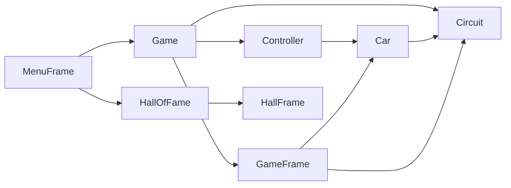

# Super Sprint Supélec

A desktop racing game inspired by [Super Sprint](http://www.giantbomb.com/super-sprint/3030-2776/), developed as the Supélec engineering software project (Sequence 6, 2014/2015).

## Features

- Top-down arcade racing with four car models and four track layouts
- One- or two-player local multiplayer (remaining slots filled by AI opponents)
- Fixed three-lap races with lap counting and race timer
- Hall of Fame leaderboard stored in the Linux user data directory
- Simple proportional–derivative (PD) controller for AI drivers

## Requirements

- JDK 17 or newer
- GNU Make
- curl and ffmpeg (car sprite preparation at build time)
- A graphical environment to play (X11 on Linux, native display on macOS/Windows)

## Quick start

From the repository root:

```bash
make run
```

This compiles sources into `build/` and launches `controller.Main`.

Other useful commands:

```bash
make compile      # compile only
make smoke-test   # headless startup check (Linux CI)
make clean        # remove build artifacts
make help         # list targets
```

See [docs/BUILD.md](docs/BUILD.md) for detailed build instructions and troubleshooting.

## Controls

| Player | Accelerate / brake | Turn |
|--------|-------------------|------|
| 1      | ↑ / ↓ arrow keys  | ← / → arrow keys |
| 2      | W / S             | A / D |

Each race runs for **3 laps**. The first car to complete the lap count wins.

## Project layout

```
src/
  controller/   Game loop, input, AI (Main entry point)
  model/        Car physics, track logic, Hall of Fame persistence
  view/         Swing menus and race rendering
  sprites/      Bundled PNG assets (cars, tracks, UI)
  data/         Seed Hall of Fame file copied on first run
docs/           Markdown documentation and UML diagrams
build/          Compiled classes and prepared car sprites (generated)
```

On Linux, runtime Hall of Fame data is stored at `$XDG_DATA_HOME/super-sprint-supelec/hall_of_fame.dat` (default: `~/.local/share/super-sprint-supelec/hall_of_fame.dat`), initialized from `src/data/hall_of_fame.dat` when missing.

## Architecture

The codebase follows **Model–View–Controller**:



- **Model** — `Car`, `Circuit`, `HallOfFame`, `Result`, `ResourcePaths`
- **View** — `MenuFrame`, `GameFrame`, `HallFrame`
- **Controller** — `Game`, `Controller`, `HumanController`, `AiController`, `GameTickTask`

See [docs/REPORT.md](docs/REPORT.md) for the full design document (English translation of the original French project report).

## Documentation

| File | Purpose |
|------|---------|
| [README.md](README.md) | Quick start (this file) |
| [docs/BUILD.md](docs/BUILD.md) | Build and run instructions |
| [docs/CONTRIBUTING.md](docs/CONTRIBUTING.md) | Code standards for contributors |
| [docs/AGENTS.md](docs/AGENTS.md) | Checklist for AI coding assistants |
| [docs/REPORT.md](docs/REPORT.md) | Project report and architecture |

## Continuous integration

GitHub Actions (`.github/workflows/ci.yml`) compiles the project and runs a headless launch smoke test on every push and pull request to `master`.

## License

This project is released under the [MIT License](LICENSE).
